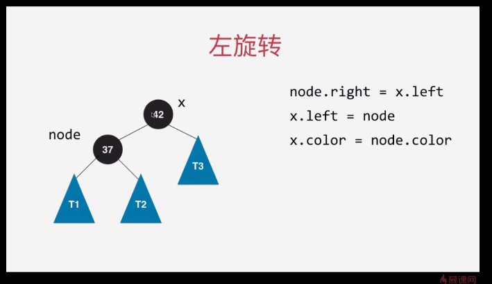

# 大名鼎鼎 ： 红黑树
> 红黑树和2-3 树 是等价的

## 2-3 树 - 是绝对平衡的树
1. 满足二分搜索树的基本性质
2. 节点可以存放一个元素或者两个元素

## 红黑树定义
1. 每个节点或者是红色的，或者 是黑色的
2. 根节点是黑色的 
3. 每个叶子节点（最后的空节点）是黑色的
4. 如果一个结点是红色的，那么他的孩子结点都是黑色的
5. 从任意一个节点到叶子节点，经过的黑色节点是一样的

