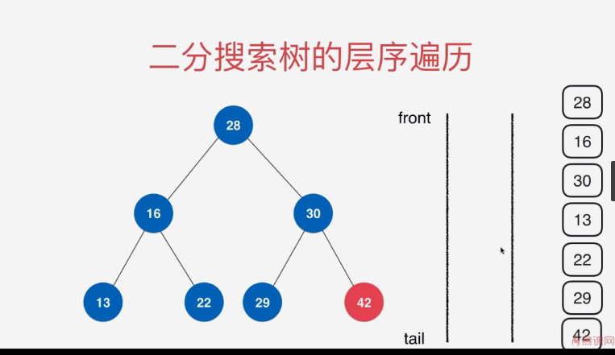
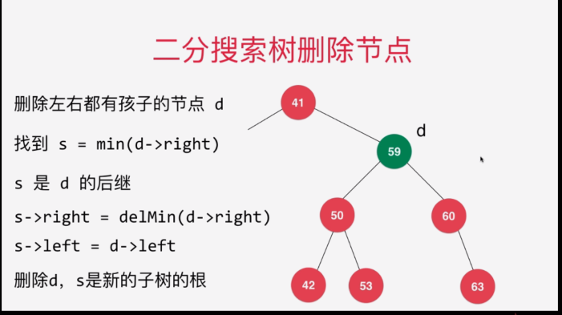
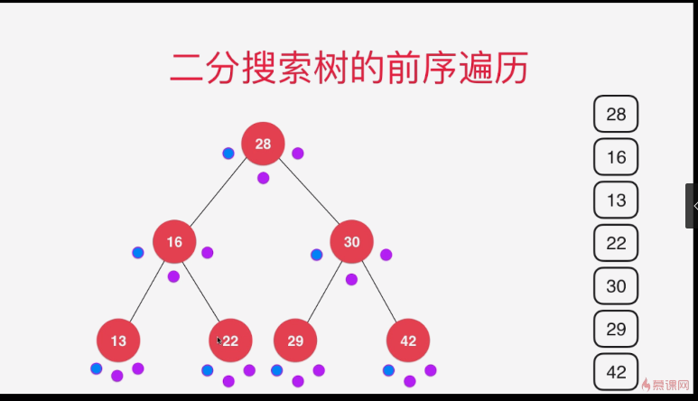
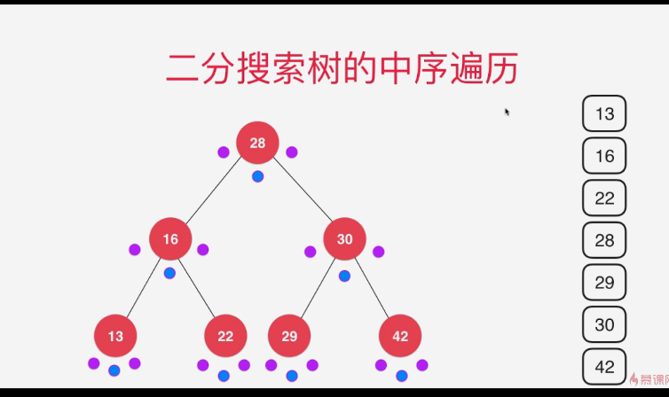
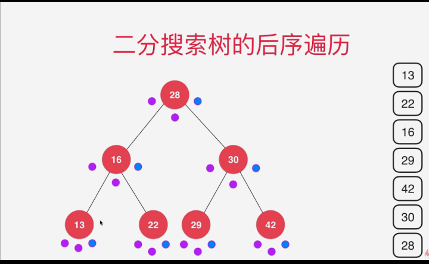

二分搜索树是二叉树
二分搜索树 的 每一个结点的值;
    大于 其左子树的所有结点的值
    小于 其右子树的所有结点的值
    
    
# 二分搜索树

## 层序遍历
> 借助队列。


1. 现将根节点如队列
2. 移出根节点，将根节点的子节点自左到右入队列
3. 移出队列中第一个元素，将元素的子节点自左到右放入队列中
4. 直到队列中没有元素为止


## 二分搜素树的最小值和最大值
> 二叉树是左节点 永远比父亲结点小
> 而右节点 永远比 父亲节点大
>
则 ： 最小值 为 二叉树最左边的值
最大值 为 二叉树最优边的值


## 二叉树 删除节点
> 当出现删除节点，同时拥有左右节点，
 
> 无论前驱还是后继都是可以满足二叉树的
>


## 二叉树的遍历

### 前序遍历
```txt
function traverse(node){
    if node === null 
        return
}
sout（node）
traverse(node.left)
traverse(node.right)
```
根 左 右
以蓝色才为操作

### 中序遍历 : 相当于结点排序
左 根 右
```txt
function traverse(node){
    if node === null 
        return
}
traverse(node.left)
sout（node）
traverse(node.right)
```

### 后序遍历
```txt
function traverse(node){
    if node === null 
        return
}
traverse(node.left)
traverse(node.right)
sout（node）
```
左 右 根



## 前序遍历的非递归实现 ：使用栈来实现
> 先压入 右孩子，在压入左孩子
> 一层一层遍历
```txt 
 public void preOrderNR(){

        Stack<Node> stack = new Stack<>();
        stack.push(root);
        while(!stack.isEmpty()){
            Node cur = stack.pop();
            System.out.println(cur.e);

            if(cur.right != null) {
                stack.push(cur.right);
            }
            if(cur.left != null) {
                stack.push(cur.left);
            }
        }
    }
```